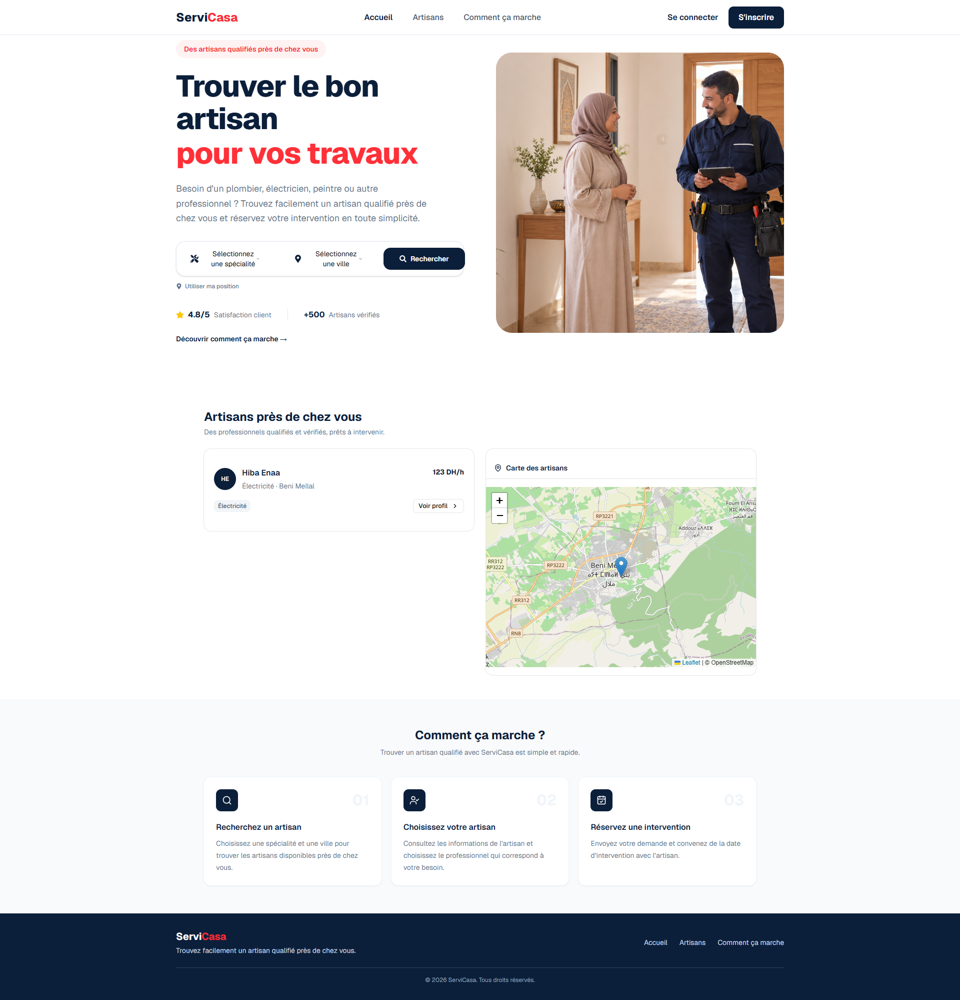

# ServiCasa --- Frontend

## 1. Nom du projet

**ServiCasa --- Frontend**

Interface web de la plateforme **ServiCasa**, permettant aux clients de
rechercher des services et de gérer leurs demandes et réservations, et
aux artisans de gérer leurs services et leurs réservations.

------------------------------------------------------------------------

## 2. Présentation

Le frontend de ServiCasa est une application web développée avec
**React**.\
Il constitue l'interface utilisateur de la plateforme et communique avec
le backend via une API REST.

Le frontend permet notamment de :

-   consulter la page d'accueil ;
-   naviguer entre les différentes fonctionnalités ;
-   gérer l'authentification ;
-   consulter les services ;
-   gérer les réservations ;
-   consulter et gérer les avis ;
-   communiquer avec l'API backend.

------------------------------------------------------------------------

## 3. Problématique

Les utilisateurs ont besoin d'une interface simple permettant d'accéder
aux services proposés par les artisans et de gérer leurs interactions
avec la plateforme.

Le frontend ServiCasa fournit une interface permettant de faciliter
cette utilisation tout en assurant la communication avec le backend.

------------------------------------------------------------------------

## 4. Fonctionnalités principales

### Client

-   inscription et connexion ;
-   consultation des services ;
-   consultation des artisans ;
-   création et suivi des réservations ;
-   consultation des réservations ;
-   gestion des avis.

### Artisan

-   accès à son espace ;
-   gestion de ses services ;
-   consultation des demandes et réservations ;
-   gestion du statut des réservations ;
-   consultation des informations liées à son activité.

### Navigation

Le frontend contient plusieurs interfaces accessibles selon le rôle de
l'utilisateur.

------------------------------------------------------------------------

## 5. Technologies utilisées

  Technologie    Utilisation
  -------------- ------------------------------------
  React          Développement de l'interface
  JavaScript     Langage principal
  HTML5          Structure des pages
  CSS3           Style et mise en page
  Vite           Outil de développement et de build
  Axios          Communication avec l'API REST
  React Router   Navigation entre les pages
  Git / GitHub   Versionnement

------------------------------------------------------------------------

## 6. Architecture Frontend

L'architecture frontend peut être représentée comme suit :

``` text
┌─────────────────────┐
│       React         │
│     Components      │
└──────────┬──────────┘
           │
           ▼
┌─────────────────────┐
│      Services       │
│       Axios         │
└──────────┬──────────┘
           │ HTTP / REST
           ▼
┌─────────────────────┐
│       Backend       │
│    Spring Boot      │
└─────────────────────┘
```

------------------------------------------------------------------------

## 7. Structure du projet

La structure du frontend est organisée autour des composants, pages,
services et ressources de l'application.

``` text
src/
├── assets/
├── components/
├── pages/
├── services/
├── routes/
├── App.jsx
└── main.jsx
```

> La structure exacte peut varier selon l'organisation actuelle du
> projet.

------------------------------------------------------------------------

## 8. Page d'accueil

La page d'accueil constitue l'interface principale permettant à
l'utilisateur d'accéder aux fonctionnalités de ServiCasa.

### Capture d'écran --- Home


------------------------------------------------------------------------

## 9. Communication avec le Backend

Le frontend communique avec le backend ServiCasa à travers des requêtes
HTTP.

``` text
Frontend React
      │
      │ HTTP / REST
      ▼
Spring Boot API
      │
      │ JPA / Hibernate
      ▼
MySQL
```

Exemple d'URL du backend en développement :

``` text
http://localhost:8080
```

------------------------------------------------------------------------

## 10. Configuration de l'API

L'URL de l'API peut être configurée avec une variable d'environnement.

Exemple :

``` env
VITE_API_URL=http://localhost:8080
```

Selon la configuration du projet, les services Axios utilisent cette URL
pour communiquer avec le backend.

------------------------------------------------------------------------

## 11. Installation

### Prérequis

Installer :

-   Node.js ;
-   npm ;
-   Git.

Vérifier Node.js :

``` bash
node -v
```

Vérifier npm :

``` bash
npm -v
```

------------------------------------------------------------------------

## 12. Installation des dépendances

Depuis le dossier frontend :

``` bash
npm install
```

------------------------------------------------------------------------

## 13. Lancement en développement

Lancer le frontend avec :

``` bash
npm run dev
```

Vite affiche ensuite l'adresse locale de l'application, généralement :

``` text
http://localhost:5173
```

------------------------------------------------------------------------

## 14. Build de production

Pour générer la version de production :

``` bash
npm run build
```

Pour prévisualiser le build :

``` bash
npm run preview
```

------------------------------------------------------------------------

## 15. Routing

La navigation entre les différentes interfaces est gérée avec **React
Router**.

Les routes permettent notamment d'accéder aux différentes parties de
l'application selon les fonctionnalités et le rôle de l'utilisateur.

------------------------------------------------------------------------

## 16. Authentification

Le frontend communique avec le backend pour :

-   créer un compte ;
-   se connecter ;
-   récupérer les informations nécessaires à la session ;
-   accéder aux fonctionnalités protégées.

Les interfaces peuvent être adaptées selon le rôle :

``` text
CLIENT
ARTISAN
ADMIN
```

------------------------------------------------------------------------

## 17. Gestion des réservations

Le frontend permet d'interagir avec le système de réservation du
backend.

Les principales opérations comprennent :

-   consultation des réservations ;
-   création d'une réservation ;
-   consultation du statut ;
-   modification du statut selon les droits de l'utilisateur.

Les données sont récupérées et envoyées au backend via l'API REST.

------------------------------------------------------------------------

## 18. Gestion des avis

Le frontend permet d'utiliser les fonctionnalités liées aux avis.

Un avis contient notamment :

``` text
note
commentaire
date de création
```

Les données sont envoyées au backend et récupérées via les endpoints
REST correspondants.

------------------------------------------------------------------------

## 19. Gestion des erreurs

Le frontend doit gérer les réponses d'erreur retournées par l'API.

Exemples :

``` text
400 — Requête invalide
401 — Non authentifié
403 — Accès interdit
404 — Ressource introuvable
500 — Erreur serveur
```

Les erreurs peuvent être affichées à l'utilisateur sous forme de
messages adaptés à l'interface.

------------------------------------------------------------------------

## 20. Responsive Design

L'interface est conçue pour s'adapter aux différentes tailles d'écran
afin de faciliter son utilisation sur :

-   ordinateur ;
-   tablette ;
-   mobile.

------------------------------------------------------------------------

## 21. Git

Pour vérifier les modifications :

``` bash
git status
```

Ajouter le README :

``` bash
git add README.md
```

Créer le commit :

``` bash
git commit -m "docs: add frontend README"
```

Envoyer les modifications :

``` bash
git push
```

------------------------------------------------------------------------

## 22. Difficultés rencontrées

Le développement du frontend peut notamment nécessiter la gestion de :

-   la communication avec l'API REST ;
-   la synchronisation des données avec le backend ;
-   la navigation entre les pages ;
-   la gestion des rôles ;
-   la gestion des erreurs HTTP ;
-   l'affichage dynamique des données ;
-   la gestion des réservations ;
-   l'intégration des avis ;
-   l'adaptation responsive de l'interface.

------------------------------------------------------------------------

## 23. Améliorations possibles

Les améliorations possibles comprennent :

-   améliorer l'expérience utilisateur ;
-   ajouter davantage de validations côté frontend ;
-   améliorer les messages d'erreur ;
-   optimiser les performances ;
-   améliorer le responsive design ;
-   ajouter davantage de tests frontend ;
-   améliorer l'accessibilité ;
-   optimiser la gestion de l'état de l'application.

------------------------------------------------------------------------

## 24. Lancement complet du projet

### 1. Lancer la base de données

Depuis le backend :

``` bash
docker compose up -d
```

### 2. Lancer le backend

``` bash
mvn spring-boot:run
```

Backend :

``` text
http://localhost:8080
```

### 3. Lancer le frontend

Depuis le dossier frontend :

``` bash
npm install
npm run dev
```

Frontend :

``` text
http://localhost:5173
```

------------------------------------------------------------------------

## 25. Checklist

-   [ ] Node.js installé
-   [ ] npm installé
-   [ ] dépendances installées avec `npm install`
-   [ ] backend démarré
-   [ ] URL API configurée
-   [ ] frontend démarré avec `npm run dev`
-   [ ] page Home accessible
-   [ ] communication Frontend / Backend vérifiée
-   [ ] authentification vérifiée
-   [ ] réservations vérifiées
-   [ ] avis vérifiés
-   [ ] responsive design vérifié

------------------------------------------------------------------------

## 26. Conclusion

Le frontend ServiCasa fournit l'interface utilisateur de la plateforme
et permet aux utilisateurs d'interagir avec les fonctionnalités
proposées par le backend.

Développé avec React et connecté à une API Spring Boot, il assure la
présentation des données, la navigation et les interactions nécessaires
à l'utilisation de la plateforme.
